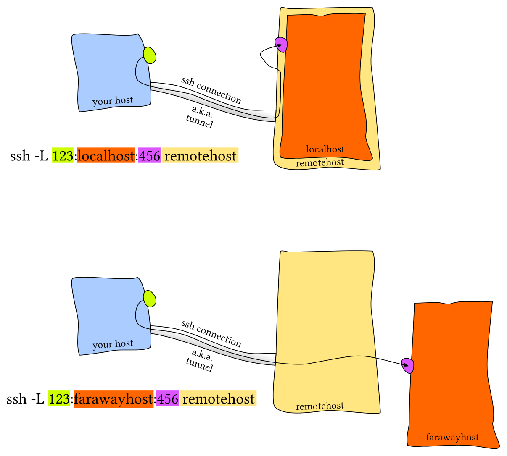

# Local, Remote and Dynamic Port Forwarding

"In computer networks, a tunneling protocol allows a network user to access or provide a network service that the underlying network does not support or provide directly. – wikipedia”
There are three different types of SSH tunneling and all used for different purposes.

## Local Port Forwarding



**Your host -- ssh client**
**remotehost -- ssh server**
**localhost/farawayhost -- resource you wanted to access**


## Remote Port Forwarding


**Your host -- ssh client**
**remotehost -- ssh server**
**localhost/nearhost -- resource you wanted to expose to remotehost**


## Dynamic Port Forwarding

Dynamic port forwarding allows to configure one local port for tunnelling data to all remote destinations. However to utilize this the client application connecting to local port should send their traffic using the SOCKS protocol. At the client side of the tunnel a SOCKS proxy would be created and the application (eg. browser) uses the SOCKS protocol to specify where the traffic should be sent when it leaves the other end of the ssh tunnel.

```shell
`ssh -D 9001 home (Executed from 'work')`
```

Here SSH will create a SOCKS proxy listening in for connections at local port
9001 and upon receiving a request would route the traffic via SSH channel
created between ‘work’ and ‘home’. For this it is required to configure the
browser to point to the SOCKS proxy at port 9001 at localhost.

[]

