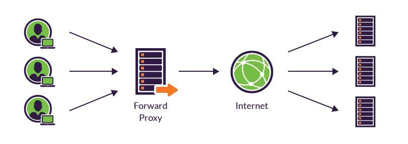

## Reverse Proxy vs Forward Proxy

A **forward proxy server** is positioned at your network’s edge, but regulates outbound traffic according to preset policies in shared networks. Additionally, it disguises a client’s IP address and blocks malicious incoming traffic.

Forward proxies are typically used internally by large organizations, such as universities and enterprises, to:

- Block employees from visiting certain websites
- Monitor employee online activity
- Block malicious traffic from reaching an origin server
- Improve the user experience by caching external site content

A reverse proxy server is an intermediate connection point positioned at a network’s edge. It receives initial HTTP connection requests, acting like the actual endpoint.

Essentially your network’s traffic cop, the reverse proxy serves as a gateway between users and your application [origin server](https://www.incapsula.com/cdn-guide/glossary/origin-server.html). In so doing it handles all policy management and traffic routing.

A reverse proxy operates by:

- Receiving a user connection request
- Completing a TCP three-way handshake, terminating the initial connection
- Connecting with the origin server and forwarding the original request

