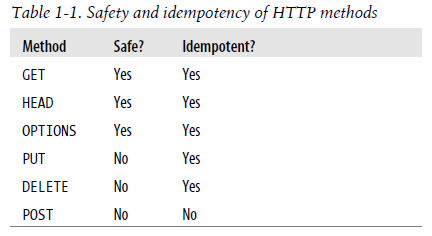

# REST

### Characteristics of HTTP Method. 

**Safe:** In HTTP, safe methods are not expected to cause side effects. To provide
this guarantee, implement safe methods as read-only operations.

**Idempotent:** Idempotency guarantees clients that repeating a request has the same effect as making
a request just once.

### Versioning

REST Endpoints can be versioned in below manner

**URI Based:** Either in subdomain, query parameter or path variable

**Media Type:** To treat each version of the resource as a different representation
so that clients can negotiate for a given version by submitting an **Accept** header
with a media type for that version. If the server supports that version, it will return a
representation of that version.

